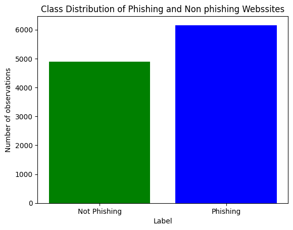
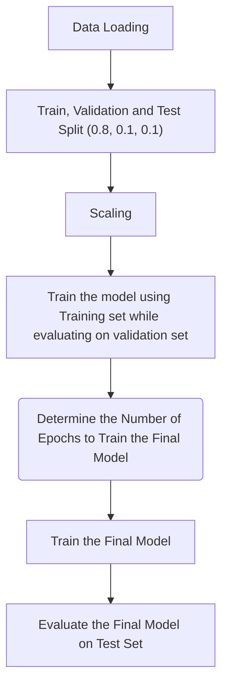
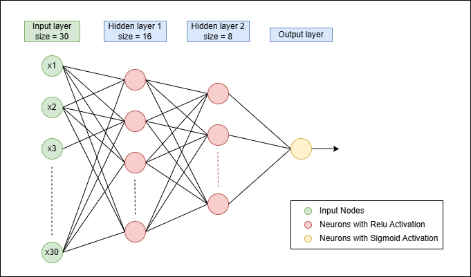
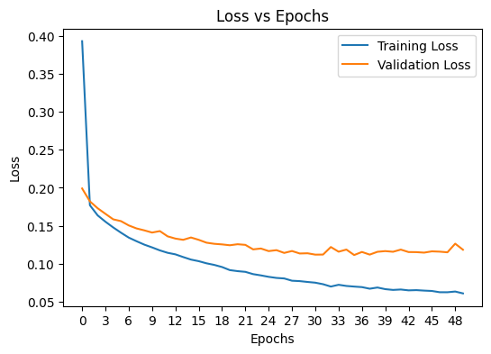
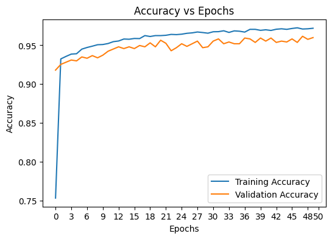
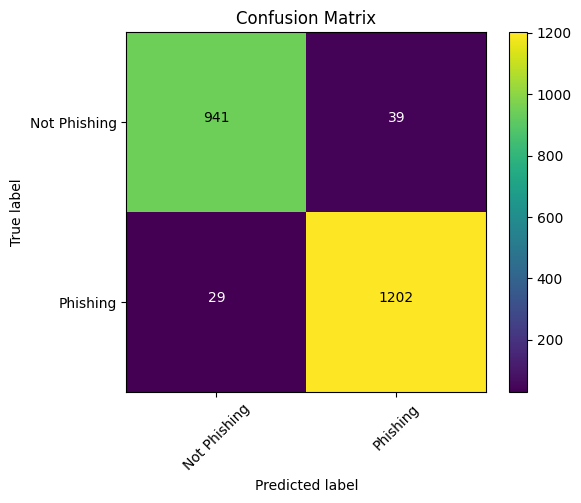

# Phishing Website Detection using MLP in Pytorch
Workflow to Classify Websites as legitimate or phishing using multi layer perceptron implemented with pytorch library

## Dataset 
Feature Columns: 

having_ip_address | url_length | shortining_service | having_at_symbol | double_slash_redirecting | prefix_suffix | having_sub_domain | sslfinal_state | domain_registration_length | favicon | port | https_token | request_url | url_of_anchor | links_in_tags | sfh | submitting_to_email | abnormal_url | redirect | on_mouseover | rightclick | popupwindow | iframe | age_of_domain | dnsrecord | web_traffic | page_rank | google_index | links_pointing_to_page |

### Class Distribution

  

## Workflow

## Model Architecture

  

## Model Evaluation

Training loss, accuracy and Validation loss, accuracy over number of epochs.

  
  

No improvement in the validation accuracy or loss after 47 epochs.Therefore final model was trained for 47 epochs.

Then the final model trained on combined train and validation set was evaluated on the unseen test data. The following results were obtained.

  <table>
    <thead>
      <tr>
        <th>Metric</th>
        <th>Phishing (Class 0)</th>
        <th>Legitimate (Class 1)</th>
        <th>Overall Metrics</th>
      </tr>
    </thead>
    <tbody>
      <tr>
        <td><b>Precision</b></td>
        <td>0.97</td>
        <td>0.96</td>
        <td rowspan="4" align="center">
          <b>Accuracy: 0.96</b> 
          

          <b>Total Support: 2211</b>
        </td>
      </tr>
      <tr>
        <td><b>Recall</b></td>
        <td>0.94</td>
        <td>0.98</td>
      </tr>
      <tr>
        <td><b>F1-Score</b></td>
        <td>0.96</td>
        <td>0.97</td>
      </tr>
      <tr>
        <td><b>Support</b></td>
        <td>980</td>
        <td>1231</td>
      </tr>
    </tbody>
  </table>

confusion matrix for the test data is shown below,

  

## Conclusion

The Multi layer perceptron performs exceptionally well in classifying website into phishing and legitimate given the feature set. It has an overall 96% accuracy. The model identifies 98% of the websites that are safe to visit and 96% of the phishing websites are identified correctly. 94% recall for phishing depicts that around 6% of the phishing websites have been misclassified.

## Areas to Improve

- feature engineering
- Hyper parameter tuning

