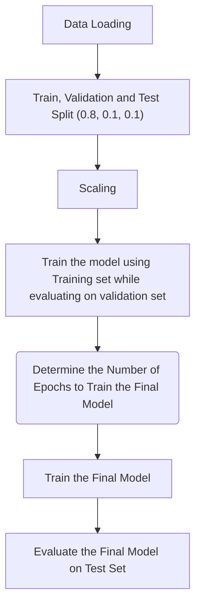

# Phishing Website Detection using MLP in Pytorch
Workflow to Classify Websites as legitimate or phishing using multi layer perceptron implemented with pytorch library

## Dataset 
Feature Columns: 

having_ip_address | url_length | shortining_service | having_at_symbol | double_slash_redirecting | prefix_suffix | having_sub_domain | sslfinal_state | domain_registration_length | favicon | port | https_token | request_url | url_of_anchor | links_in_tags | sfh | submitting_to_email | abnormal_url | redirect | on_mouseover | rightclick | popupwindow | iframe | age_of_domain | dnsrecord | web_traffic | page_rank | google_index | links_pointing_to_page |

### Class Distribution

  

## Workflow

## Model Architecture

  

